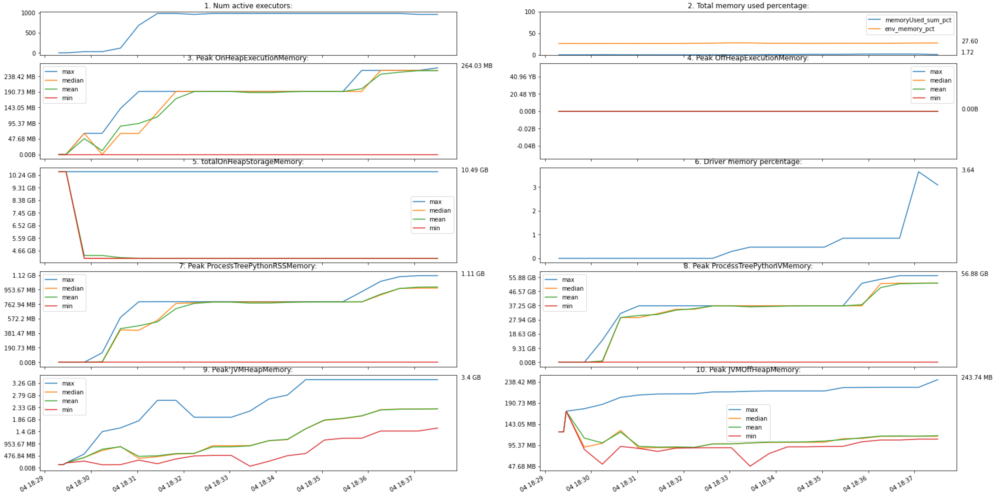

sparkmon
========

|PyPI| |Python Version| |License|

|Read the Docs| |Tests| |Codecov|

|pre-commit| |Black|

.. |PyPI| image:: https://img.shields.io/pypi/v/sparkmon.svg
   :target: https://pypi.org/project/sparkmon/
   :alt: PyPI
.. |Python Version| image:: https://img.shields.io/pypi/pyversions/sparkmon
   :target: https://pypi.org/project/sparkmon
   :alt: Python Version
.. |License| image:: https://img.shields.io/pypi/l/sparkmon?
   :target: https://opensource.org/licenses/Apache-2.0
   :alt: License
.. |Read the Docs| image:: https://img.shields.io/readthedocs/sparkmon/latest.svg?label=Read%20the%20Docs
   :target: https://sparkmon.readthedocs.io/
   :alt: Read the documentation at https://sparkmon.readthedocs.io/
.. |Tests| image:: https://github.com/stephanecollot/sparkmon/workflows/Tests/badge.svg
   :target: https://github.com/stephanecollot/sparkmon/actions?workflow=Tests
   :alt: Tests
.. |Codecov| image:: https://codecov.io/gh/stephanecollot/sparkmon/branch/master/graph/badge.svg
   :target: https://codecov.io/gh/stephanecollot/sparkmon
   :alt: Codecov
.. |pre-commit| image:: https://img.shields.io/badge/pre--commit-enabled-brightgreen?logo=pre-commit&logoColor=white
   :target: https://github.com/pre-commit/pre-commit
   :alt: pre-commit
.. |Black| image:: https://img.shields.io/badge/code%20style-black-000000.svg
   :target: https://github.com/psf/black
   :alt: Black

Features
--------

Monitoring plot example:

* Logs the executors metrics
* Create a monitoring thread directly in your PySpark application
* Plot monitoring for a remote Spark application in a notebook, or in a file
* Command line interface for a remote Spark application

Requirements
------------

* Python
* Spark

Installation
------------

You can install *sparkmon* via pip_ from PyPI_:

.. code:: console

   $ pip install sparkmon

Usage
-----

Please see the `Command-line Reference <Usage_>`_ for details.

Contributing
------------

Contributions are very welcome.
To learn more, see the `Contributor Guide`_.

License
-------

Distributed under the terms of the `Apache 2.0 license`_,
*sparkmon* is free and open source software.

Issues
------

If you encounter any problems,
please `file an issue`_ along with a detailed description.

Credits
-------

This project was generated from `@cjolowicz`_'s `Hypermodern Python Cookiecutter`_ template.

.. _@cjolowicz: https://github.com/cjolowicz
.. _Cookiecutter: https://github.com/audreyr/cookiecutter
.. _Apache 2.0 license: https://opensource.org/licenses/Apache-2.0
.. _PyPI: https://pypi.org/
.. _Hypermodern Python Cookiecutter: https://github.com/cjolowicz/cookiecutter-hypermodern-python
.. _file an issue: https://github.com/stephanecollot/sparkmon/issues
.. _pip: https://pip.pypa.io/
.. github-only
.. _Contributor Guide: CONTRIBUTING.rst
.. _Usage: https://sparkmon.readthedocs.io/en/latest/usage.html
